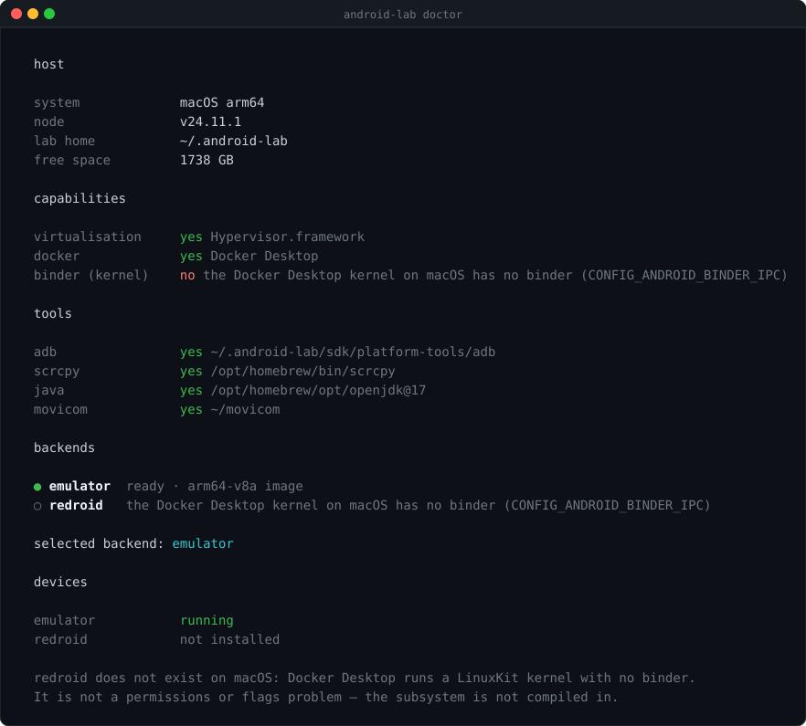
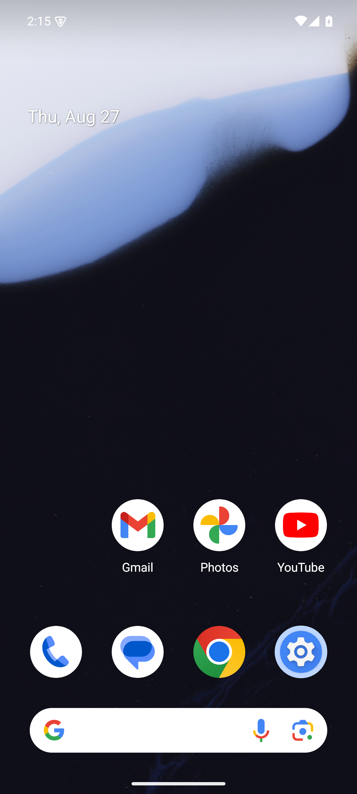
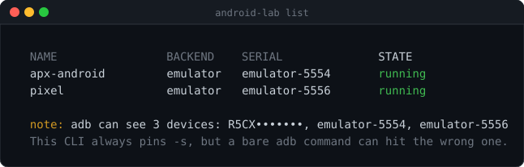

# android-lab

A virtual Android you can drive from ADB, [Movicom](https://github.com/andycufari/movicom)
and AI agents. One command to boot it, see it and poke at it.

```
virtual Android  ->  ADB  ->  Movicom  ->  MCP / APX  ->  your agent
```

```bash
npx android-lab doctor    # what can run on this machine
npx android-lab setup     # install whatever is missing
npx android-lab start     # boot it, waiting for the real boot to finish
npx android-lab screen    # see it and drive it with mouse and keyboard
```

Or install it: `npm i -g android-lab`, then `android-lab start`.



`doctor` probes the host rather than guessing from the OS name, and says which
backend it picked and why.





Run as many as your RAM allows; ports and serials are handed out automatically.

<br clear="right">


## Commands

| Command | What it does |
|---|---|
| `doctor` | Which backend can run here, what is missing, how to fix it |
| `setup [--yes]` | Install the backend and create the device. Asks a few questions; `--yes` skips them |
| `start [--window]` | Boot it. Reports success only at `sys.boot_completed=1` |
| `stop` | Clean shutdown. Never wipes data |
| `status [--json]` | State, version, visible devices |
| `list` | Every device you have created |
| `screen [--shot]` | scrcpy to view and drive, or a single PNG screenshot |
| `shell [cmd...]` | A terminal inside Android |
| `adb <args...>` | Raw adb, already pinned to this device |
| `logs [--follow]` | Backend log |
| `update [--check-only]` | Update SDK packages or the container image, and check npm |
| `clean [--remove\|--all]` | Factory reset · delete the device · delete everything |

With no arguments `shell` drops you into an interactive terminal; with arguments
it runs and exits, forwarding the device's own output and exit code. Both work
the same against the emulator and the container.

## Several devices at once

Every command takes `--name`. Ports and serials are allocated automatically and
remembered, so devices never collide:

```bash
android-lab setup --name pixel && android-lab start --name pixel
android-lab shell --name pixel
android-lab list
```

```
NAME                BACKEND    SERIAL              STATE
apx-android         emulator   emulator-5554       running
pixel               emulator   emulator-5556       running
```

The limit is your RAM, not the tool: each emulator asks for ~4 GB. Console ports
run from 5554 to 5682, so 65 devices in theory.

A device's identity comes from its AVD (or container) name, never from its port —
which is what keeps a stopped device from looking alive just because another one
took its old port.

## Backends

**`emulator`** — Native Android Emulator. Runs on all three systems using each
one's own virtualisation: Hypervisor.framework on macOS, KVM on Linux, WHPX on
Windows. The default everywhere except Linux with binder.

**`redroid`** — Android as a Docker container, no emulation: the system runs
straight on the host kernel. Boots in seconds instead of a minute, and weighs far
less. **Native Linux only.**

The backend is picked automatically. `android-lab doctor` tells you which one it
chose and why. Force it with `--backend emulator|redroid`.

### Why redroid does not run on macOS or Windows

redroid shares the host kernel and needs that kernel to expose `binder`
(Android's IPC). Docker Desktop on macOS and Windows does not run on your kernel:
it runs a Linux VM whose LinuxKit kernel is built without
`CONFIG_ANDROID_BINDER_IPC`. `mount -t binder` there returns `No such device`.

It is not a permissions or flags problem: the whole subsystem is missing, and it
cannot be added without replacing the VM's kernel. The same thing rules out
Waydroid, which additionally needs the host's Wayland session.

That is why the default off Linux is the native emulator, which uses the system's
own virtualisation and needs none of this.

## Platform support

| System | Backend | Status |
|---|---|---|
| macOS Apple Silicon | `emulator` | **Verified on hardware** — M4, Android 15 arm64 |
| Linux x86_64 + KVM | `emulator` | **Verified on hardware** — Ubuntu 24.04, Android 15 x86_64 |
| Linux x86_64 + binder | `redroid` | **Verified on hardware** — Ubuntu 24.04, Android 14 |
| macOS Intel | `emulator` | Same path as Apple Silicon, `x86_64` image. Untested |
| Windows + WHPX | `emulator` | Coded with runtime detection. Untested |

The three verified rows each pass the full [smoke test](test/smoke.sh) — every
command against a real booted device, including persistence across a restart.

Windows is the honest gap: the code detects WHPX and fails with a specific
message rather than breaking silently, but nobody has run it. `android-lab
doctor` is the first thing to try there, and issues are welcome.

## Driving a device on another machine

A device running elsewhere is driven over adb's TCP transport. Nothing is
installed locally — the ~5 GB of SDK and the RAM stay on its host, which is the
point: a laptop can drive an Android living on a server.

```bash
android-lab status --host 192.168.1.10:5555
android-lab shell  --host 192.168.1.10:5555
android-lab screen --shot --host 192.168.1.10:5555 --out /tmp/now.png
```

`setup`, `start` and `clean` refuse over `--host` and tell you to run them where
the device lives — you cannot create a device on a machine you are only talking
to. Everything that drives an existing one works.

The `redroid` backend already publishes its port, so a container on a Linux box
is reachable as soon as it is up. For the emulator, its console port is bound to
localhost, so forward it:

```bash
ssh -L 5555:localhost:5554 user@host      # emulator console port on the host
android-lab status --host localhost:5555
```

> **adb over TCP has no authentication.** Anyone who can reach the port owns the
> device. Keep it on a private network — Tailscale, a VPN, or the SSH tunnel
> above. Do not publish 5555 to the internet.

## Docker

## Docker

The compose file lives in [`docker/docker-compose.yml`](docker/docker-compose.yml)
and backs the `redroid` backend. On Linux:

```bash
sudo modprobe binder_linux devices=binder,hwbinder,vndbinder   # once per host boot
android-lab start --backend redroid
```

The CLI does the `modprobe`, the `docker run` and the `adb connect` for you; the
compose file is there if you would rather bring it up by hand.

There is no Dockerfile because there is nothing to build: `redroid/redroid`
already publishes the images. And the `emulator` backend cannot live in a
container — it needs the host's virtualisation directly.

The CLI never installs Docker for you. Installing a system daemon needs root and
changes the machine well beyond this tool's business, so `doctor` detects it and
prints the command for your platform instead.

## Persistence

No snapshots (`fastboot.forceColdBoot=yes`): state comes from `userdata`, not from
frozen RAM. Apps, settings, files and sessions survive `stop`/`start`. Verified
across repeated cycles on macOS.

On `redroid`, `/data` is mounted from the host, so state survives even deleting
and recreating the container.

`stop` runs `sync` before cutting power and never uses `-wipe-data`. To
deliberately throw state away, use `clean`.

Known exception on the emulator: `screen_off_timeout` is overwritten by the
emulator on every boot. That is not a persistence failure.

## Cleaning up

```bash
android-lab clean                  # factory reset: keeps the device and the SDK
android-lab clean --remove         # delete the device, keep the ~5 GB SDK
android-lab clean --all            # delete everything, SDK included
```

All three ask for confirmation first, and refuse to guess when they are not
running in a terminal. `--yes` skips the prompt for scripts.

## When a real phone is plugged in too

With two Androids visible, an `adb` call without `-s` fails with
`MULTIPLE_DEVICES` — or worse, hits the wrong device. This CLI **always** pins
`-s`, and `status` warns you when more than one device is around.

For Movicom, pin it too:

```bash
ADB="$(which adb) -s emulator-5554" node ~/movicom/movicom.js ui frame
```

## Letting an agent drive it

Anything that can run a shell command can drive this: [Claude Code](https://claude.com/claude-code),
Codex, OpenCode, Cursor, Aider, Gemini CLI. There is nothing to integrate — the
CLI *is* the interface, `--json` gives machine-readable state, and `shell`
forwards the device's own exit codes.

**[AGENTS.md](AGENTS.md) is the contract for autonomous use**: install and boot
with no prompts, the failure modes worth knowing, and the device-pinning rule
that keeps an agent off your real phone.

```bash
npm i -g android-lab && android-lab setup --yes
```

For [APX](https://github.com/agentprojectcontext/apx), register an MCP pinned to
this device, so a delegated agent cannot touch your real phone even by accident:

```bash
apx mcp add android-emu \
  --command "$(which node)" ~/movicom/mcp/src/server.js \
  --env MOVICOM_BIN=~/movicom/movicom.js \
  --env ADB="$(which adb)" \
  --env MOVICOM_ADB="$(which adb)" \
  --env MOVICOM_DEVICE=emulator-5554
```

Then:

```bash
apx exec -a <agent> "Load the tools with discover_tools query android.
Then open Settings on the Android and tell me what you see. Use emulator-5554 only."
```

Two things that are hard to discover on your own:

- The `android_*` tools **are not attached by default**: the agent has to call
  `discover_tools` first.
- `apx send --deliver` and `call_agent` run the target agent **with no tool
  schema** — they are pure conversational relay. The only path that actually
  executes is `apx exec -a <agent>`.

## Configuration

Environment only, no config files:

| Variable | Default |
|---|---|
| `ANDROID_LAB_HOME` | `~/.android-lab` — where everything heavy lives |
| `ANDROID_LAB_BACKEND` | automatic |
| `ANDROID_LAB_NAME` | `apx-android` |
| `ANDROID_API` | `35` |
| `SYSTEM_IMAGE` | `system-images;android-35;google_apis;<host abi>` |
| `EMU_SERIAL` | auto-allocated |
| `REDROID_IMAGE` | `redroid/redroid:14.0.0-latest` |
| `REDROID_PORT` | auto-allocated from 5555 |
| `MOVICOM_HOME` | `~/movicom` |

`ANDROID_LAB_HOME` is the one that matters if you do not want ~7 GB in your home
directory:

```bash
export ANDROID_LAB_HOME=/Volumes/my-disk/android-lab
```

## Requirements

Node ≥ 18 and a real JDK (`brew install openjdk@17`, `apt install openjdk-17-jdk`,
`winget install EclipseAdoptium.Temurin.17.JDK`) — `sdkmanager` and `avdmanager`
are Java wrappers. On macOS, `/usr/bin/java` is a stub that is not a runtime;
`doctor` verifies Java by actually running it.

`setup` downloads the rest: platform-tools, the emulator and the system image
(~5 GB). `screen` needs `scrcpy` (`brew install scrcpy`, `apt install scrcpy`,
`winget install Genymobile.scrcpy`).

There is no build step. It is plain ESM JavaScript with zero dependencies, so
`npx` starts instantly and there is nothing to compile.

## Releasing

The patch version bumps itself on every commit, so the published version always
moves forward without anyone remembering. Enable the hook once per clone:

```bash
git config core.hooksPath .githooks
```

A hand-written version change wins over the hook, so a minor or major bump is
just editing `package.json` in the same commit. `SKIP_VERSION_BUMP=1 git commit`
opts out for merges and fixups.

## Licence

MIT
